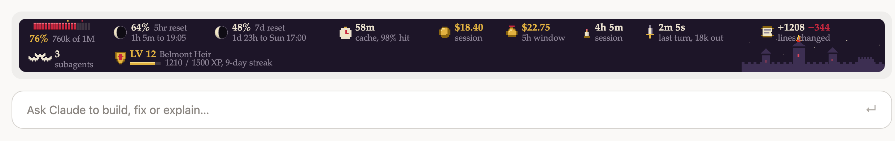
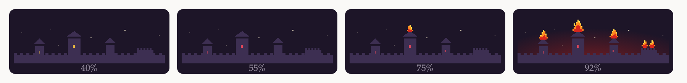
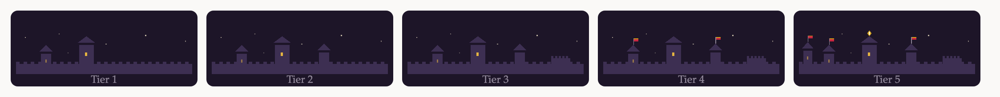
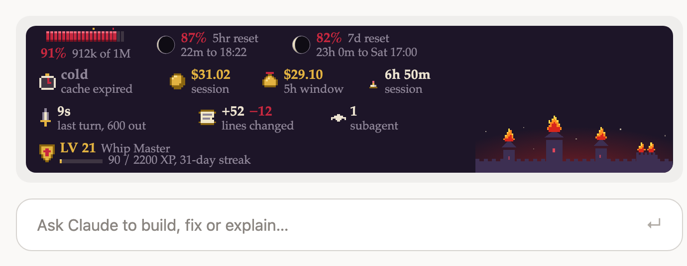

# Claude Castle Mod

A Castlevania-style HUD for Claude Code. It sits above the prompt and shows what a session is using as it goes: the context window, the rate limits, the prompt cache, the cost and the subagents. A castle on the right catches fire as the context fills up.



It also has a small levelling game: you earn XP, keep a daily streak and unlock achievements as you work.

## Install

In Claude Code, run these three commands:

```
/plugin marketplace add eddywong888/claude-castle-mod
/plugin install castle-hud@claude-castle-mod
/reload-plugins
```

The HUD appears after the reload, in the desktop app's Code tab. If it doesn't show up, restart Claude Code.

A mod is code that runs inside Claude Code on your machine, with the same access Claude Code has. Read the source in `hooks/` before installing, as you would with any package.

To update later, run:

```
/plugin marketplace update claude-castle-mod
/plugin update castle-hud@claude-castle-mod
/reload-plugins
```

If the HUD doesn't change after the reload, restart Claude Code. Restart any other open windows too, so they all run the same version.

## What it shows

| | Section | What it means |
|---|---|---|
|  | **Blood meter** | How full the context window is: 20 cells, 5% each. The number turns gold from 60% and red from 85%. |
|  | **Moons** | One per rate-limit window (5-hour, and 7-day once Claude Code reports it). Full moon when the window has just refreshed, waning to a new moon as it nears its reset. Shows the percent used, the time left and the reset time. |
|  | **Stopwatch** | How long the prompt cache stays warm, and how much of the last reply's input it served. Reply while it's warm and the conversation is read from cache cheaply. |
|  | **Coin** | What this session has cost. |
|  | **Money bag** | What every session running the mod spent in the current 5-hour window. Starts again from $0 when the window resets. |
|  | **Candle** | How long the session has run. The candle burns down over eight hours. |
|  | **Dagger** | How long the last reply took and how many tokens it wrote. |
|  | **Scroll** | Lines added and removed by Claude's Edit and Write tools in this conversation. |
|  | **Bats** | One flapping bat per subagent running now. |
|  | **Crest** | Your level, title, XP toward the next level and your daily streak. |

### The castle burns

As the context fills, the castle reacts: its windows turn from gold to red at 50%, a small fire starts at 70%, a bigger one at 80%, and the whole castle is ablaze with a red glow at 90%. That's your cue to wrap up or start a fresh session before Claude Code compacts the conversation.



### Build up the castle

Every compaction raises the castle one tier, up to five: your own `/compact`, or the one Claude Code runs itself when the context is full. The fire burns as the context fills, and compacting puts the fire out and rebuilds the castle bigger. The castle always has its three towers and the keep, and grows bolder with each tier: banners at tier 2, more lit windows and a gold trim at 3, a taller main spire at 4, and at tier 5 a gold crest, brighter stone and a soft golden glow. The tier is kept across sessions.





On a narrow window the sections wrap onto more rows, each at full size. The castle keeps its own column on the right, so the flames never cover a number.

## Levels, streaks and achievements

| You do | XP |
|---|---|
| Finish a turn (a cancelled one doesn't count) | +10 |
| Change lines in that turn | +1 per 10 lines, up to +50 |
| Reply while the cache is warm | +5 |
| Finish a turn under 60% context | +5 |
| Run tests that pass (npm, pnpm, yarn or bun test, pytest, jest, vitest, go test, cargo test and others) | +25 |
| A subagent finishes | +15 |

Each level needs a little more XP than the last. Titles change at level 1 (Wanderer), 5 (Vampire Hunter), 10 (Belmont Heir), 20 (Whip Master), 35 (Night Stalker) and 50 (Lord of the Castle).

Your **streak** counts the days in a row with at least one finished turn. There are 14 **achievements**, from First Blood (your first turn) to Eternal Night (a 30-day streak). A pop-up appears for each level-up and each new achievement.

Type `/castle` to see your level, where your XP came from and every achievement. Type `/castle reset` to start again from level 1: it asks you to confirm, then deletes everything the mod saved.

## Good to know

- **Cache life.** The stopwatch counts down one hour from each reply, the life of Claude Code's prompt cache. A reply counts as warm when it comes within that hour. If you switch model and Claude Code reports a five-minute cache, it counts down five minutes instead. A compaction or a model switch starts the stopwatch again.
- **The 5-hour total** counts only sessions running this mod, from when it was installed. Usage on claude.ai or in other tools isn't included.
- **Lines changed** counts only Claude's Edit and Write tools. Files changed by shell commands such as `sed` or `git` aren't counted.
- **After a restart** a conversation's lines changed, last turn and cache stopwatch come back as they were. `/clear` starts them over; `/resume` brings back the resumed conversation's. A conversation's figures are kept for a month after you last used it.
- **XP and the 5-hour total** are kept in the mod's own storage on your machine, a file under `~/.claude/plugins/store/` whose name starts with `castle-hud_`. Nothing is sent anywhere. Each session's XP is added to one saved total when its conversation ends, so the file stays small.
- **Where it shows.** The HUD draws in the desktop app's Code tab. It draws nothing in a terminal, so a status line you've set up there stays as it is, and Claude Code doesn't offer this band in VS Code. Levels, XP and `/castle` still work everywhere.

## What the hooks do

The mod only reads what Claude Code reports. It never blocks, changes or rewrites anything.

| Hook | What it does |
|---|---|
| `session.start` | Reads the session's usage, registers `/castle` and starts a 15-second refresh |
| `session.end` | Saves this conversation's figures and your XP, and adds the XP to the saved total |
| `turn.start` | Notes when a turn starts, to tell whether it found the cache warm |
| `session.compact` | After a compaction finishes, raises the castle a tier and shows the smaller context. The compaction itself is unchanged |
| `classic.SessionStart` | When a cleared, resumed, forked or compacted conversation starts, reads its starting cost and context. A cleared or forked one starts its figures at zero; a resumed one gets its saved figures back |
| `classic.PostModelSwitch` | After `/model`, starts the cache stopwatch again and notes how long the new cache lasts |
| `session.measure` | Reads the context, rate limits and cost after each turn |
| `tool.call` | After Edit or Write succeeds, counts the lines changed. After a Bash test command passes, adds XP. Always passes the call through unchanged |
| `command.run` | Answers `/castle` with your level and achievements, and `/castle reset` |
| `agent.spawn` | Notes a new subagent for the bat count. The subagent starts unchanged |
| `turn.complete` | Records the last turn's time, output tokens, cache use and XP. The answer is unchanged |
| `ui.render` | Draws the HUD above the prompt |

## Development

The mod is a Claude Code plugin made of function hooks:

| File | What it holds |
|---|---|
| `hooks/register.tsx` | The hooks: usage readings, cost tracking, subagents, XP, and drawing the band |
| `hooks/svg.ts` | The pixel-art drawing for the desktop app, and the castle |
| `hooks/hud.ts` | Moons, the cache, line counting and formatting |
| `hooks/xp.ts` | Levels, streaks and achievements |
| `types/index.d.ts` | The mod's state, for type-checking |

To try changes from a clone, start Claude Code with `claude --plugin-dir <this folder>`. To check them:

```bash
claude plugin validate .
```

```bash
claude plugin test .
```

The screenshots and icons are renders of the mod's own drawing code with sample numbers.

## License

[MIT](LICENSE)
